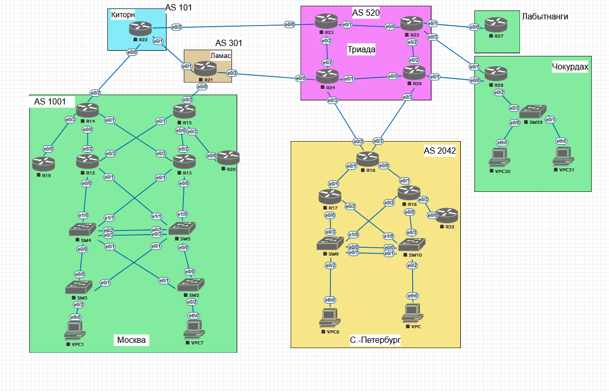

#  Проектирование сети

###  Задание:

Распланировать адресное пространство, настроить IP на активных портах для дальнейшей работы над проектом и задокументировать адресацию.  
  

## Топология:
- **AS 1001**: Москва
- **AS 2042**: С.-Петербург  
- **AS 520**: Триадa
- **AS 101**: Китрон
- **AS 301**: Ламас
- **Чокурдах**
- **Лабытнанги**
  

## Адресация:

#### 1. Таблица адресации сетевых устройств "Москва (AS 1001)":
| Устройство    | Интерфейс    | IP-адресс          |
|--------------:|:-------------|-------------------:|
| R12           | loopback     | 10.21.37.2/32      | 
| R12           | e0/0.21      | 10.21.73.2/25      | 
| R12           | e0/1.24      | 10.21.10.2/25      | 
| R12           | e0/1.11      | 10.2.2.102/25      | 
| R12           | e0/2.22      | 10.21.3.2/25       | 
| R12           | e0/3.23      | 10.21.7.2/25       | 
| R13           | loopback     | 10.21.37.3/32      | 
| R13           | e0/0.24      | 10.21.10.3/25      | 
| R13           | e0/1.21      | 10.21.37.3/25      | 
| R13           | e0/1.11      | 10.2.2.103/25      | 
| R13           | e0/2.22      | 10.21.3.3/25       | 
| R13           | e0/3.23      | 10.21.7.3/25       | 
| R14           | loopback     | 10.21.37.4/32      | 
| R14           | e0/0.22      | 10.21.3.4/25       | 
| R14           | e0/1.23      | 10.21.7.4/25       | 
| R14           | e0/2.21      | 10.21.73.4/25      | 
| R14           | e0/3.24      | 10.21.10.4/25      | 
| R15           | loopback     | 10.21.37.5/32      | 
| R15           | e0/0.22      | 10.21.3.5/25       | 
| R15           | e0/1.23      | 10.21.7.5/25       | 
| R15           | e0/2.21      | 10.21.37.5/25      | 
| R15           | e0/3.24      | 10.21.10.5/25      | 
| R19           | loopback     | 10.21.37.6/32      | 
| R19           | e0/0.24      | 10.21.10.6/25      | 
| R20           | loopback     | 10.21.37.7/32      | 
| R20           | e0/0.24      | 10.21.10.7/25      | 
| SW2           | Vlan 37      | 10.37.21.2/25      | 
| SW2           | Vlan 21      | 10.21.37.22/25     | 
| SW3           | Vlan 37      | 10.37.21.3/25      | 
| SW3           | Vlan 24      | 10.21.12.32/25     | 
| SW4           | Vlan 37      | 10.37.21.4/25      | 
| SW5           | Vlan 37      | 10.37.21.5/25      | 
| VPC1          | Vlan 11      | 10.2.2.2/25        | 
| VPC7          | Vlan 11      | 10.2.2.3/25        | 

#### 2. Таблица адресации сетевых устройств "С.-Петербург (AS 2042)":
| Устройство    | Интерфейс    | IP-адресс          |
|--------------:|:-------------|-------------------:|
| R16           | loopback     | 10.21.37.8/32      | 
| R16           | e0/0.21      | 10.21.73.8/25      | 
| R16           | e0/1.22      | 10.21.3.8/25       | 
| R16           | e0/2.24      | 10.21.10.8/25      | 
| R16           | e0/3.23      | 10.21.7.8/25       | 
| R17           | loopback     | 10.21.37.9/32      | 
| R17           | e0/0.24      | 10.21.10.9/25      | 
| R17           | e0/1.23      | 10.21.7.9/25       | 
| R17           | e0/1.12      | 10.2.3.109/25      | 
| R17           | e0/2.21      | 10.21.73.9/25      | 
| R18           | loopback     | 10.21.37.10/32     | 
| R18           | e0/0.22      | 10.21.3.10/25      | 
| R18           | e0/1.23      | 10.21.7.10/25      | 
| R18           | e0/1.22      | 10.2.3.100/25      | 
| R18           | e0/2.24      | 10.21.10.10/25     | 
| R18           | e0/3.21      | 10.21.73.10/25     | 
| R32           | loopback     | 10.21.37.11/32     | 
| R32           | e0/0.23      | 10.21.7.11/25      | 
| SW9           | Vlan 37      | 10.37.21.6/25      | 
| SW9           | Vlan 24      | 10.21.10.66/25     | 
| SW10          | Vlan 37      | 10.37.21.7/25      | 
| SW10          | Vlan 21      | 10.21.73.77/25     | 
| VPC8          | Vlan 12      | 10.2.3.2/25        | 
| VPC           | Vlan 12      | 10.2.3.3/25        | 

#### 3. Таблица адресации сетевых устройств "Чокурдах":
| Устройство    | Интерфейс    | IP-адресс          |
|--------------:|:-------------|-------------------:|
| R28           | loopback     | 10.21.37.12/32     | 
| R28           | e0/2.22      | 10.21.3.12/25      | 
| R28           | e0/1.21      | 10.21.73.12/25     | 
| R28           | e0/0.23      | 10.21.7.12/25      | 
| R28           | e0/2.13      | 10.2.4.1/25        | 
| SW29          | Vlan 37      | 10.37.21.8/25      | 
| SW29          | Vlan 22      | 10.21.3.82/25      | 
| VPC30         | Vlan 13      | 10.2.4.2/28        | 
| VPC31         | Vlan 13      | 10.2.4.3/28        | 

#### 4. Таблица адресации сетевых устройств "Триада (AS 520)":
| Устройство    | Интерфейс    | IP-адресс          |
|--------------:|:-------------|-------------------:|
| R23           | loopback     | 10.21.37.13/32     | 
| R23           | e0/0.23      | 10.21.7.13/25      | 
| R23           | e0/1.22      | 10.21.3.13/25      | 
| R23           | e0/2.21      | 10.21.73.13/25     | 
| R24           | loopback     | 10.21.37.14/32     | 
| R24           | e0/0.23      | 10.21.7.14/25      | 
| R24           | e0/1.22      | 10.21.3.14/25      | 
| R24           | e0/2.21      | 10.21.73.14/25     | 
| R24           | e0/3.24      | 10.21.10.14/25     | 
| R25           | loopback     | 10.21.37.15/32     |  
| R25           | e0/0.22      | 10.21.3.15/25      |  
| R25           | e0/1.23      | 10.21.7.15/25      | 
| R25           | e0/2.24      | 10.21.10.15/25     | 
| R25           | e0/3.21      | 10.21.73.15/25     | 
| R26           | loopback     | 10.21.37.16/32     | 
| R26           | e0/0.22      | 10.21.3.16/25      | 
| R26           | e0/1.23      | 10.21.7.16/25      | 
| R26           | e0/2.24      | 10.21.10.16/25     | 
| R26           | e0/3.21      | 10.21.73.16/25     | 

#### 5. Таблица адресации сетевых устройств "Лабытнанги":
| Устройство    | Интерфейс    | IP-адресс          |
|--------------:|:-------------|-------------------:|
| R27           | loopback     | 10.21.37.17/32     | 
| R25           | e0/0.23      | 10.21.7.17/25      | 

#### 6. Таблица адресации сетевых устройств "Китрон (AS 101)":
| Устройство    | Интерфейс    | IP-адресс          |
|--------------:|:-------------|-------------------:|
| R22           | loopback     | 10.21.37.18/32     | 
| R22           | e0/0.21      | 10.21.73.18/25     | 
| R22           | e0/1.22      | 10.21.3.18/25      | 
| R22           | e0/2.23      | 10.21.7.18/25      | 

#### 7. Таблица адресации сетевых устройств "Лампас (AS 301)":
| Устройство    | Интерфейс    | IP-адресс          |
|--------------:|:-------------|-------------------:|
| R21           | loopback     | 10.21.37.19/32     | 
| R21           | e0/0.21      | 10.21.73.19/25     | 
| R21           | e0/1.22      | 10.21.3.19/25      | 
| R21           | e0/2.23      | 10.21.7.19/25      | 

##  Конфигурации:
  ###  [Маршрутизаторы][def]  
  ###  [Коммутаторы][def1]  

[def]: conf/base_conf.md 
[def1]: conf/base_conf2.md  

#### VLAN:
   Vlan 21,22,23,24 для связи устройств  
   Vlan 37 Уровень доступа  
   Vlan 11,12,12 Users  
   Vlan 696 Заглушка  
   Vlan 777 Native  

#### OSPF:
    Настрайваем на каждом роутере для управления по сети 10.21.37.***

#### HSRP:
  ##### Москва:
    R12/R13 standby 11 ip 10.2.2.1
  ##### C.Петербург:
    R17/R18  standby 12 ip 10.2.3.1